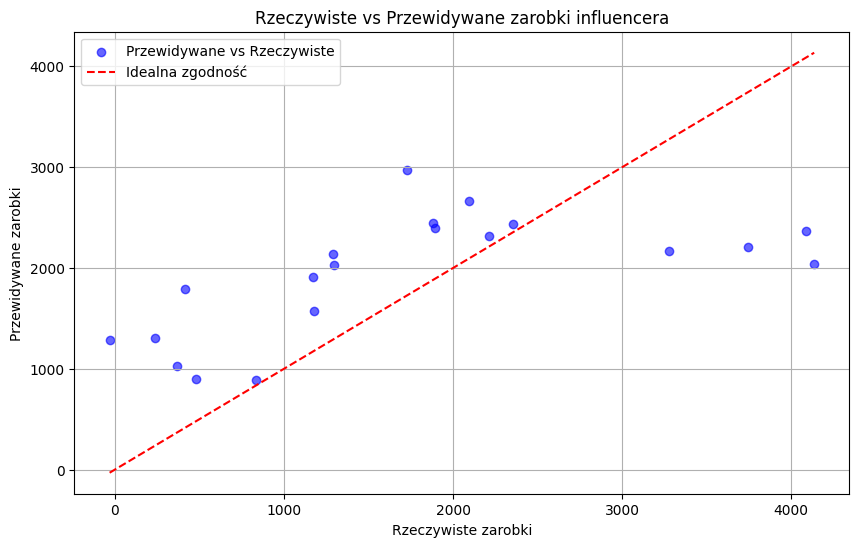

# Predicting Influencer Income

## Project Description
This project demonstrates the use of linear regression to predict influencer income based on:
- **Number of followers**
- **Engagement rate**
- **Number of posts per month**
- **Influencer niche** (lifestyle, gaming, fitness, tech)

By analyzing these factors, the model can estimate monthly income for influencers with reasonable accuracy.

---

## Technologies Used
- Python
- Pandas
- NumPy
- Scikit-learn
- Matplotlib

---

## Features
1. **Synthetic data generation**: Simulating realistic influencer data.
2. **Model training**: Using linear regression to learn relationships between input features and income.
3. **Visualization**: Comparing actual vs predicted influencer income using scatter plots.

---

## How to Run
1. Open the `.ipynb` file in **Google Colab** or **Jupyter Notebook**.
2. Run each code cell step by step.
3. Check the results of the model and visualizations.

---

## Results
- The model achieves a high \(R^2\) score, indicating a strong fit to the data.
- Example visualization:  

---

## Visualization
The scatter plot below shows the relationship between actual and predicted influencer income, along with the ideal fit line:

---

## Author
[Your Name]

---

## License
This project is licensed under the MIT License. Feel free to use, modify, and distribute it as needed.
